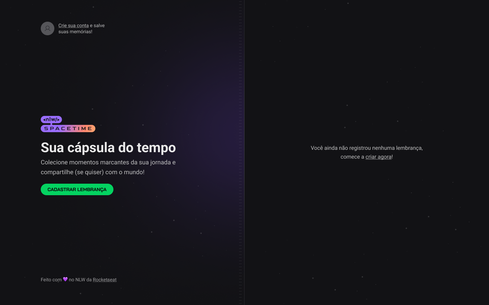

<h1 align="center">Spacetime</h1>

 Projeto desenvolvido no NLW Spacetime.  

  <a href="#-tecnologias">Tecnologias</a>&nbsp;&nbsp;&nbsp;|&nbsp;&nbsp;&nbsp;
  <a href="#-layout">Layout</a>&nbsp;&nbsp;&nbsp;|&nbsp;&nbsp;&nbsp;
   <a href="#-vercel">Spacetime vercel.app</a>&nbsp;&nbsp;&nbsp;|&nbsp;&nbsp;&nbsp;
  <a href="#memo-licença">Licença</a>

  

 

  

## 🚀 Tecnologias

Esse projeto foi desenvolvido com as seguintes tecnologias:

- HTML
- React
- Next.js 13
- Typescript
- Tailwind CSS
- Lucide
- Axios

## 🔖 Layout

Você pode visualizar o layout do projeto através [DESSE LINK](https://www.figma.com/file/ZAXlRLWfzXjeBeicLKxEin/C%C3%A1psula-do-tempo-%E2%80%A2-Trilha-Ignite-(Community)?type=design&node-id=19-3&t=Dr7qrEcYP5GxhSsb-0). É necessário ter conta no [Figma](https://figma.com) para acessá-lo.

## 🔖 Vercel

Você pode visualizar o projeto na vercel através [DESSE LINK](https://nlw-spacetime-sigma.vercel.app/).

---

## :memo: Licença
